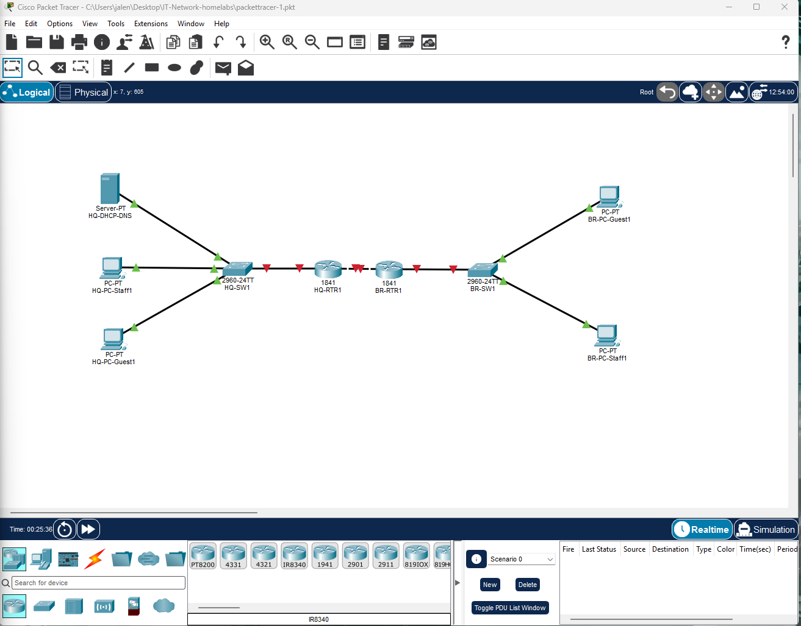
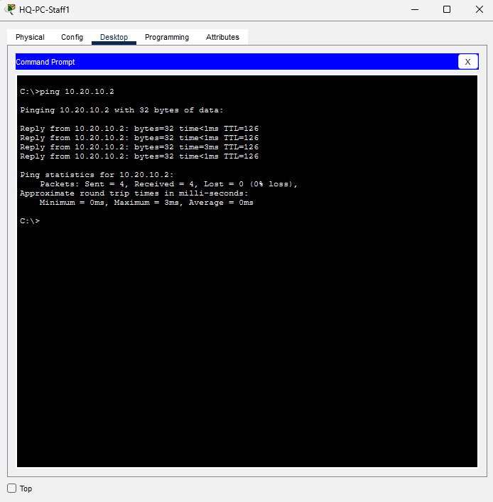
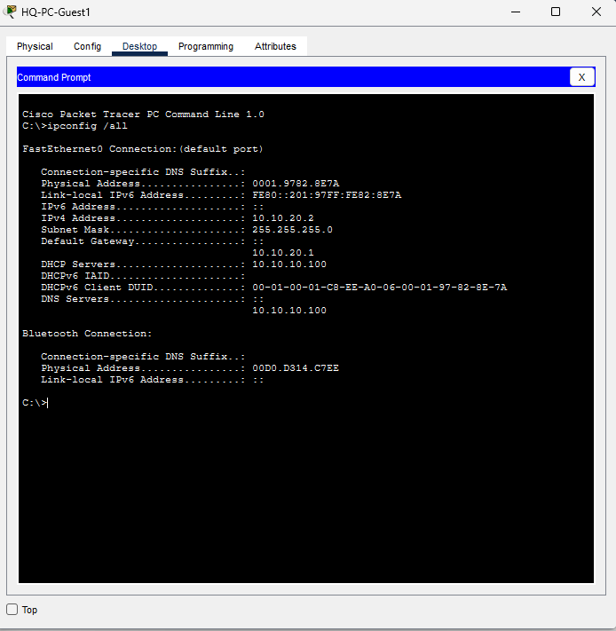
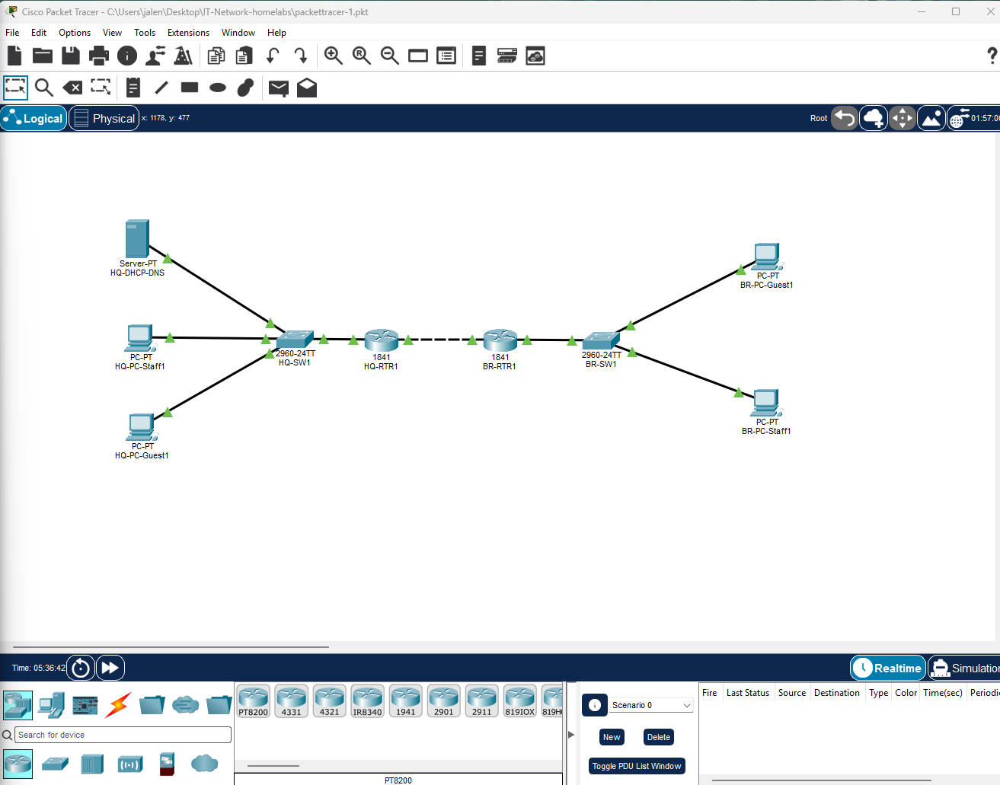

# Two-Site Enterprise Network Simulation (Cisco Packet Tracer)

Simulated a two-site enterprise network (HQ and Branch) connected over a WAN link, with VLAN-segmented Staff and Guest networks at each site. Configured router-on-a-stick inter-VLAN routing, converted static routing to OSPF for dynamic route propagation, implemented an extended ACL to enforce Guest-to-Staff network segmentation, and deployed centralized DHCP/DNS with cross-subnet relay. Documented four real troubleshooting scenarios encountered during the build — including a mistaken trunk port assignment, a switch port left on default VLAN, DHCP pool misconfigurations, and an unresolved same-subnet DHCP edge case — each diagnosed using layered `show` command verification rather than trial-and-error.

**Topology:** 2 routers, 2 switches, 4 client PCs, 1 DHCP/DNS server, WAN link, 4 subnets across 2 sites.

**Packet Tracer file:** [two-site-network.pkt](two-site-network.pkt)



## VLAN Configuration

### HQ-SW1
```
1    default                          active    Fa0/3, Fa0/4, Fa0/5, Fa0/6
                                                Fa0/7, Fa0/8, Fa0/9, Fa0/10
                                                Fa0/11, Fa0/12, Fa0/13, Fa0/14
                                                Fa0/15, Fa0/16, Fa0/17, Fa0/18
                                                Fa0/19, Fa0/20, Fa0/21, Fa0/22
                                                Fa0/23, Fa0/24, Gig0/1, Gig0/2
10   Staff                            active    Fa0/1
20   Guest                            active    Fa0/2
1002 fddi-default                     active    
1003 token-ring-default               active    
1004 fddinet-default                  active    
1005 trnet-default                    active    
```

### BR-SW1
```
1    default                          active    Fa0/3, Fa0/4, Fa0/5, Fa0/6
                                                Fa0/7, Fa0/8, Fa0/9, Fa0/10
                                                Fa0/11, Fa0/12, Fa0/13, Fa0/14
                                                Fa0/15, Fa0/16, Fa0/17, Fa0/18
                                                Fa0/19, Fa0/20, Fa0/21, Fa0/22
                                                Fa0/23, Fa0/24, Gig0/1, Gig0/2
10   Staff                            active    Fa0/1
20   Guest                            active    Fa0/2
1002 fddi-default                     active    
1003 token-ring-default               active    
1004 fddinet-default                  active    
1005 trnet-default                    active    
```

## Router Subinterface Configuration

### HQ-RTR1
```
Interface              IP-Address      OK? Method Status                Protocol 
FastEthernet0/0        unassigned      YES unset  up                    up 
FastEthernet0/0.10     10.10.10.1      YES manual up                    up 
FastEthernet0/0.20     10.10.20.1      YES manual up                    up 
FastEthernet0/1        unassigned      YES unset  administratively down down 
Vlan1                  unassigned      YES unset  administratively down down
```

### BR-RTR1
```
Interface              IP-Address      OK? Method Status                Protocol 
FastEthernet0/0        unassigned      YES unset  up                    up 
FastEthernet0/0.10     10.20.10.1      YES manual up                    up 
FastEthernet0/0.20     10.20.20.1      YES manual up                    up 
FastEthernet0/1        unassigned      YES unset  administratively down down 
Vlan1                  unassigned      YES unset  administratively down down
```

## WAN Link Configuration

### HQ-RTR1
```
Interface              IP-Address      OK? Method Status                Protocol 
FastEthernet0/0        unassigned      YES unset  up                    up 
FastEthernet0/0.10     10.10.10.1      YES manual up                    up 
FastEthernet0/0.20     10.10.20.1      YES manual up                    up 
FastEthernet0/1        192.168.100.1   YES manual up                    up 
Vlan1                  unassigned      YES unset  administratively down down
```

### BR-RTR1
```
Interface              IP-Address      OK? Method Status                Protocol 
FastEthernet0/0        unassigned      YES unset  up                    up 
FastEthernet0/0.10     10.20.10.1      YES manual up                    up 
FastEthernet0/0.20     10.20.20.1      YES manual up                    up 
FastEthernet0/1        192.168.100.2   YES manual up                    up 
Vlan1                  unassigned      YES unset  administratively down down
```

**Note:** Fa0/1's protocol initially showed down until BR-RTR1's side was configured — confirms both ends of a point-to-point link need matching subnet config before line protocol comes up.

## Static Routing

### HQ-RTR1
```
     10.0.0.0/24 is subnetted, 4 subnets
C       10.10.10.0 is directly connected, FastEthernet0/0.10
C       10.10.20.0 is directly connected, FastEthernet0/0.20
S       10.20.10.0 [1/0] via 192.168.100.2
S       10.20.20.0 [1/0] via 192.168.100.2
     192.168.100.0/30 is subnetted, 1 subnets
C       192.168.100.0 is directly connected, FastEthernet0/1
```

### BR-RTR1
```
     10.0.0.0/24 is subnetted, 4 subnets
S       10.10.10.0 [1/0] via 192.168.100.1
S       10.10.20.0 [1/0] via 192.168.100.1
C       10.20.10.0 is directly connected, FastEthernet0/0.10
C       10.20.20.0 is directly connected, FastEthernet0/0.20
     192.168.100.0/30 is subnetted, 1 subnets
C       192.168.100.0 is directly connected, FastEthernet0/1
```

## Troubleshooting: Trunk Port Misconfiguration

**Symptom:** HQ-PC-Staff1 could not reach its own default gateway (10.10.10.1), despite correct VLAN assignment on its access port and correct router subinterface configuration.

**Diagnosis:**
1. Verified PC IP configuration — correct (10.10.10.10/24, gateway 10.10.10.1)
2. Verified access port VLAN assignment via `show interfaces fa0/1 switchport` — correct, in VLAN 10
3. Checked trunk status via `show interfaces trunk` on HQ-SW1 — **empty**, meaning no trunk was active despite earlier `switchport mode trunk` command
4. Discovered the trunk command had been applied to Fa0/3 (an assumed port) rather than Gig0/1, the port actually cabled to HQ-RTR1

**Root cause:** Trunk configuration was applied to the wrong interface. Additionally, attempting `switchport trunk encapsulation dot1q` on Gig0/1 failed — the 2960 switch platform only supports 802.1Q trunking natively and does not expose the encapsulation command (used on platforms that also support ISL, like the 3560).

**Fix:**
```
interface gig0/1
 switchport mode trunk
```

**Result:** `show interfaces trunk` confirmed Gig0/1 active as a trunk carrying VLANs 10 and 20. Full connectivity restored — verified via successful ping from HQ-PC-Staff1 to local gateway, WAN link (router-to-router), remote gateway, and cross-site PC-to-PC.

## Dynamic Routing: OSPF

Converted from static routes to OSPF (area 0, process ID 1) to demonstrate dynamic route propagation between sites.

### HQ-RTR1 (show ip route)
```
     10.0.0.0/24 is subnetted, 4 subnets
C       10.10.10.0 is directly connected, FastEthernet0/0.10
C       10.10.20.0 is directly connected, FastEthernet0/0.20
O       10.20.10.0 [110/2] via 192.168.100.2, 00:21:13, FastEthernet0/1
O       10.20.20.0 [110/2] via 192.168.100.2, 00:21:13, FastEthernet0/1
     192.168.100.0/30 is subnetted, 1 subnets
C       192.168.100.0 is directly connected, FastEthernet0/1
```

### BR-RTR1 (show ip route)
```
     10.0.0.0/24 is subnetted, 4 subnets
O       10.10.10.0 [110/2] via 192.168.100.1, 00:19:41, FastEthernet0/1
O       10.10.20.0 [110/2] via 192.168.100.1, 00:19:41, FastEthernet0/1
C       10.20.10.0 is directly connected, FastEthernet0/0.10
C       10.20.20.0 is directly connected, FastEthernet0/0.20
     192.168.100.0/30 is subnetted, 1 subnets
C       192.168.100.0 is directly connected, FastEthernet0/1
```

Compared to the earlier static configuration, OSPF routes (`O`) replace the manually entered static routes (`S`) while producing identical reachability — confirming dynamic route propagation is functioning correctly.

**Verification — cross-site ping (HQ-PC-Staff1 → BR-PC-Staff1):**



## Access Control List (ACL) — HQ

Configured an extended ACL on HQ-RTR1 to block Guest VLAN traffic from reaching Staff VLAN resources, both locally and across the WAN link, while permitting all other traffic.

```
Extended IP access list BLOCK-GUEST-TO-STAFF
    10 deny ip 10.10.20.0 0.0.0.255 10.10.10.0 0.0.0.255
    20 deny ip 10.10.20.0 0.0.0.255 10.20.10.0 0.0.0.255
    30 permit ip any any
```

Applied inbound on FastEthernet0/0.20 (HQ Guest subinterface).

**Test results:**
- HQ-PC-Guest1 → HQ-PC-Staff1 (10.10.10.10): **Unreachable** (blocked, as intended)
- HQ-PC-Guest1 → BR-PC-Guest1 (10.20.20.10): **Reachable** (permitted, confirms ACL is scoped correctly and not overly broad)

**Note:** Initial ACL only included one deny rule instead of two, causing Guest-to-Staff traffic to fall through to the permit-any rule. Rebuilt the ACL with both deny lines in place, confirmed via `show access-lists` match counters before retesting.

## Access Control List (ACL) — Branch

Applied the same Guest-to-Staff restriction on BR-RTR1.

```
Extended IP access list BLOCK-GUEST-TO-STAFF
    10 deny ip 10.20.20.0 0.0.0.255 10.20.10.0 0.0.0.255
    20 deny ip 10.20.20.0 0.0.0.255 10.10.10.0 0.0.0.255
    30 permit ip any any (3 match(es))
```

**Test results:**
```
C:\>ping 10.20.10.10 (BR-PC-Staff1)

Pinging 10.20.10.10 with 32 bytes of data:

Reply from 10.20.20.1: Destination host unreachable.
Reply from 10.20.20.1: Destination host unreachable.
Reply from 10.20.20.1: Destination host unreachable.
Reply from 10.20.20.1: Destination host unreachable.

Ping statistics for 10.20.10.10:
    Packets: Sent = 4, Received = 0, Lost = 4 (100% loss)

C:\>ping 10.10.20.10 (HQ-PC-Guest1)

Pinging 10.10.20.10 with 32 bytes of data:

Reply from 10.10.20.10: bytes=32 time<1ms TTL=126
Reply from 10.10.20.10: bytes=32 time<1ms TTL=126
Reply from 10.10.20.10: bytes=32 time<1ms TTL=126
Reply from 10.10.20.10: bytes=32 time=4ms TTL=126

Ping statistics for 10.10.20.10:
    Packets: Sent = 4, Received = 4, Lost = 0 (0% loss)
```

**Note:** The blocked ping returns "Destination host unreachable" from the local gateway (10.20.20.1) rather than a silent timeout — this confirms the ACL is actively denying and generating an ICMP response, rather than the traffic simply having no route.

## DHCP/DNS Configuration

Configured server (HQ-DHCP-DNS, 10.10.10.100) with four DHCP pools — one per VLAN/site — plus `ip helper-address` relay on non-local router subinterfaces so all four subnets could reach the single centralized server.

**Troubleshooting encountered:**
1. **Server unreachable from routers** — root cause: the switch port connecting the server to HQ-SW1 was still on default VLAN 1, never explicitly assigned to VLAN 10. Fixed with `switchport access vlan 10` on that port.
2. **DHCP requests still failing after reachability was restored** — root cause: DHCP service itself was toggled off on the server; pool configuration alone doesn't enable the service. Fixed by enabling DHCP service in the server's Services tab.
3. **HQ-PC-Staff1 received an APIPA address** — root cause: the HQ-Staff DHCP pool's starting address overlapped with an address already in use (server or gateway), causing lease failures on that specific subnet even though Guest's pool worked fine. Fixed by adjusting the pool's start address to fall outside both the gateway (10.10.10.1) and server (10.10.10.100) addresses.

**Result:** HQ-PC-Guest1 successfully obtained an IP via DHCP after fixes 1 and 2 above.

**Verification (HQ-PC-Guest1, via ipconfig /all):**



**Known issue:** HQ-Staff DHCP pool (10.10.10.0/24, same subnet as the DHCP server) consistently returned 0.0.0.0 for Default Gateway and DNS Server despite correct pool configuration and pool recreation, while all other pools (relying on ip helper-address relay) functioned correctly. Root cause not isolated within lab timeframe — possible Packet Tracer-specific DHCP server behavior when client and server share a subnet without a relay hop. **Workaround:** HQ-PC-Staff1 configured with static IP (10.10.10.2 / 255.255.255.0 / gateway 10.10.10.1 / DNS 10.10.10.100) instead of DHCP.

## Final Topology



*Note: the WAN link between HQ-RTR1 and BR-RTR1 renders as a dashed line in Packet Tracer's logical view — this reflects the platform's serial-style link rendering, not a fault. Connectivity across this link was confirmed via CLI (`show ip interface brief`, `show ip route`) and the cross-site ping test above.*
