# Lab 11 — ServiceNow PDI: Catalog Items, Incidents, SLAs & Dashboards

## Objective
Build and test real IT service management workflows in a live ServiceNow 
Personal Developer Instance, including access request catalog items, 
onboarding workflows, incident management, SLA review, and dashboard creation.

## Platform
- ServiceNow Personal Developer Instance (developer.servicenow.com)
- Free — no credit card required

## Skills Demonstrated
- ServiceNow Catalog Builder
- Catalog item creation with custom variables/questions
- Approval workflow configuration
- Incident creation, work notes, and resolution
- SLA definition review and analysis
- Report creation (bar chart, pie chart)
- Dashboard creation with data visualization widgets

## Tools Used
- ServiceNow PDI (dev299488.service-now.com)
- ServiceNow Catalog Builder
- ServiceNow Incident Management
- ServiceNow SLA Definitions
- ServiceNow Reports & Dashboards

---

## Part A — Access Request Catalog Item

### What I Built
A self-service catalog item that allows employees to request membership 
to an Active Directory security group.

### Form Fields
| Field | Type | Purpose |
|-------|------|---------|
| Employee Name | Text (single-line) | Identifies the requestor |
| Manager Name | Text (single-line) | Identifies approving manager |
| Access Type | Dropdown | Read Only / Read Write / Admin |
| Business Justification | Text (multi-line) | Documents reason for access request |

### Workflow
- Fulfillment flow: Service Catalog Item Request
- Approval required before fulfillment
- Submitted test request: REQ0010001 — Status: Approved

### Key Learning
Access request catalog items mirror real IAM workflows, where employees 
request access through a self-service portal, a manager approves, and 
IT fulfills the request. This is the standard access provisioning pattern 
in enterprise environments.

### Screenshots
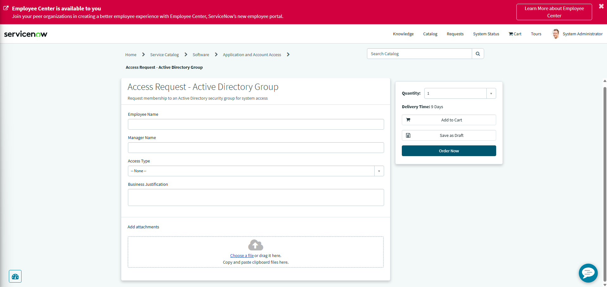
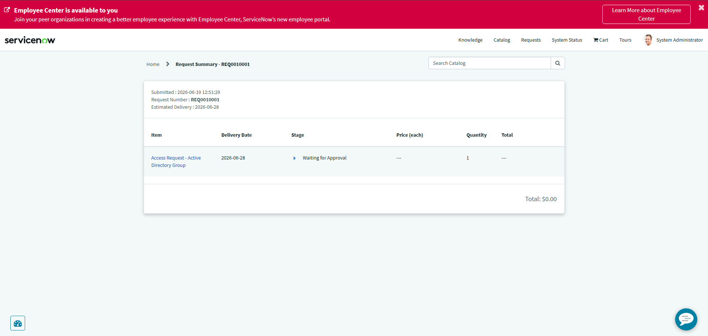

---

## Part B — New Employee Onboarding Catalog Item

### What I Built
A self-service catalog item for IT onboarding of new hires, covering 
AD account creation, laptop provisioning, and department assignment.

### Form Fields
| Field | Type | Purpose |
|-------|------|---------|
| Employee Name | Text (single-line) | New hire name |
| Start Date | Date | First day of employment |
| Department | Dropdown | IT / HR / Finance / Sales |
| Manager | Text (single-line) | Reporting manager |
| Laptop Required | Dropdown | Yes / No |
| Active Directory Account Needed | Dropdown | Yes / No |

### Workflow
- Fulfillment flow: Service Catalog Item Request
- Approval required before fulfillment
- Submitted test request — Status: Waiting for Approval

### Key Learning
Onboarding catalog items consolidates multiple IT tasks into a single 
request. In real environments, these trigger automated provisioning 
workflows that create AD accounts, assign licenses, and configure 
workstations without manual intervention from IT.

### Screenshots
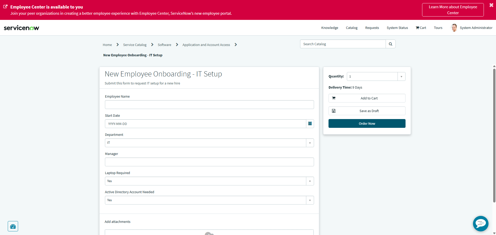
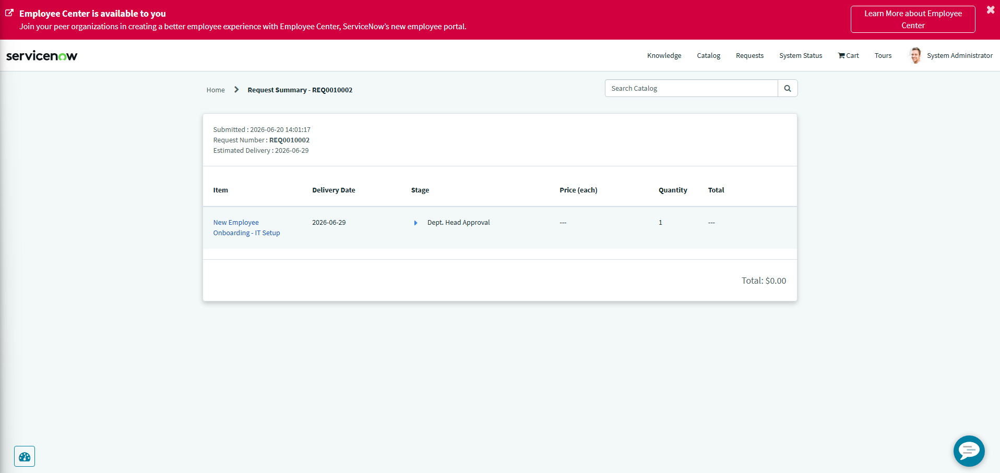

---

## Part C — Incident Management

### Scenario Simulated
User account locked — cannot authenticate to the domain.

### Incident Details
| Field | Value |
|-------|-------|
| Number | INC0010003 |
| Caller | Abel Tuter |
| Category | Software |
| Subcategory | Operating System |
| Impact | 1 - High |
| Urgency | 2 - Medium |
| Priority | 2 - High |
| State | Resolved |

### Work Notes (Internal)
Confirmed user identity via employee ID. Account locked due to multiple 
failed login attempts. Unlocking an account in Active Directory using 
Unlock-ADAccount -Identity aturner. Advising the user on the password policy 
to prevent repeat lockout.

### Resolution
- Resolution code: Solution provided
- Resolution notes: Confirmed user identity. Unlocked account in Active 
Directory using Unlock-ADAccount -Identity aturner. Advised the user to 
change password at next login using Ctrl+Alt+Del to avoid repeat lockout.

### Key Learning
Work notes are internal-only and document the analyst's investigation 
steps. Comments are customer-visible. Keeping these separate is standard 
help desk practice — customers see updates, not internal troubleshooting 
notes. Resolution codes create a searchable record of how incidents are 
resolved for trend analysis.

### Screenshots
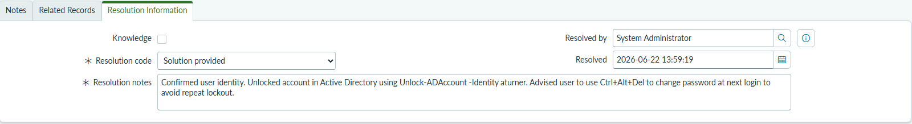
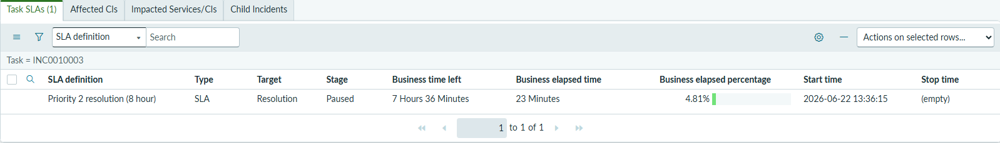

---

## Part D — SLA Review

### SLA Reviewed
Priority 2 resolution (8 hours) — pre-configured in ServiceNow PDI.

### SLA Definition Settings
| Field | Value |
|-------|-------|
| Type | SLA |
| Target | Resolution |
| Duration | 8 Hours |
| Schedule | 8-5 weekdays |
| Table | Incident [incident] |

### Start Condition
- Active = true
- Priority = 2 - High

### Stop Condition
- Incident state = Closed

### Observed in Action
The SLA timer fired automatically on INC0010003 (Priority 2 - High) 
showing 7 hours 56 minutes remaining at time of review — confirming 
the SLA attached correctly based on priority.

### Key Learning
SLAs run only during business hours (8-5 weekdays), meaning the timer 
pauses nights and weekends. This is critical in enterprise environments 
where SLA breach penalties apply — a P2 incident opened Friday at 4 pm 
does not breach until after 8 hours of business time, not 8 calendar hours.

### Screenshots
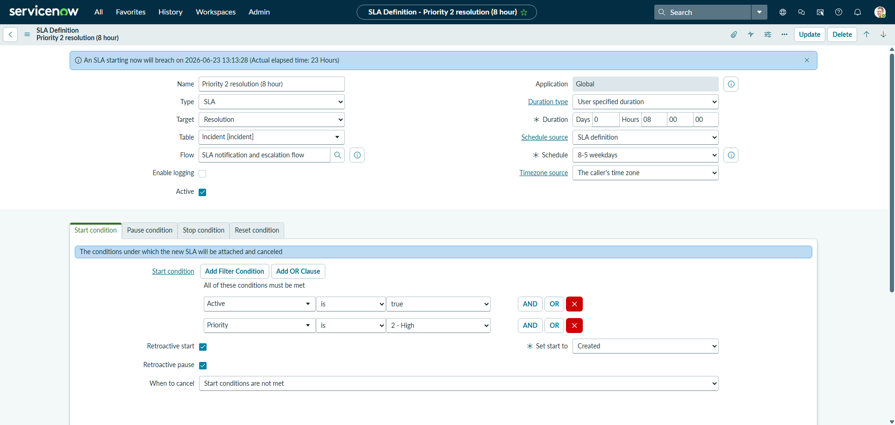
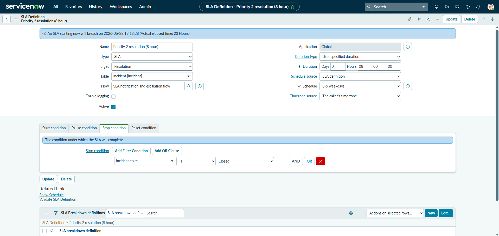

---

## Part E — Reports & Dashboard

### Reports Created

**Report 1 — Monthly Incidents by Priority**
- Type: Bar chart (vertical)
- Source: Incident [incident]
- Group by: Priority
- Shows distribution of incidents across all priority levels

**Report 2 — SLA Breach Rate**
- Type: Pie chart
- Source: Task SLA [task_sla]
- Group by: Has breached
- Result: 75% breached / 25% not breached (based on PDI sample data)

### Dashboard Created
- Name: IT Help Desk Overview
- Widgets: Incidents created by priority, Incidents nearing SLA

### Key Learning
Dashboards give IT managers and help desk leads real-time visibility 
into ticket volume, priority distribution, and SLA health. Being able 
to build and interpret these reports is a core IT operations skill 
expected at Tier 2 and above.

### Screenshots
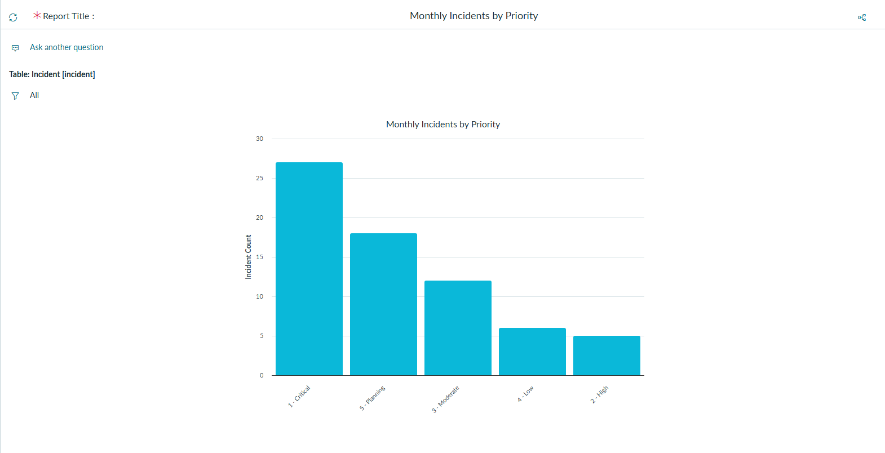
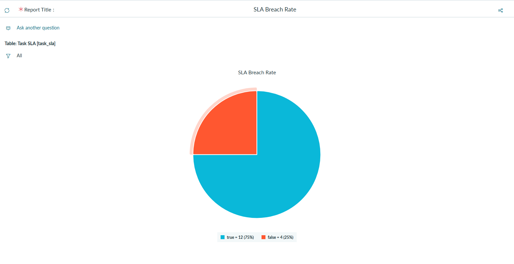
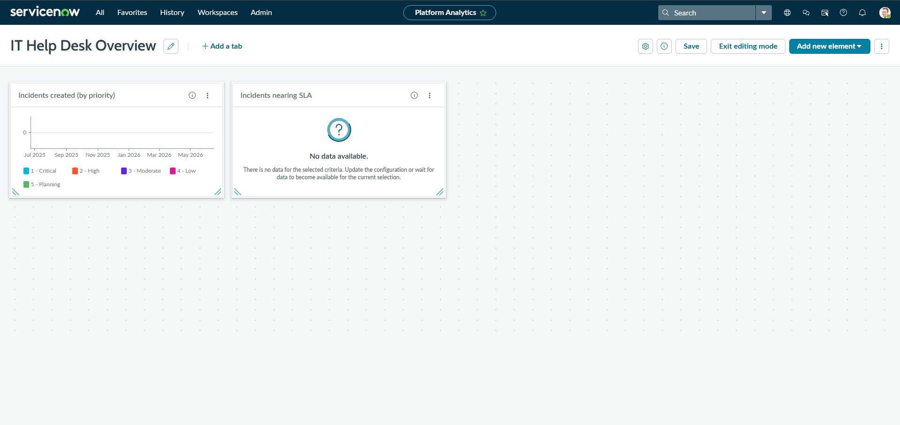

---
---

## References
- [ServiceNow Developer Program](https://developer.servicenow.com)
- [ServiceNow Docs — Catalog Builder](https://docs.servicenow.com)
- [ServiceNow Docs — SLA Management](https://docs.servicenow.com)
