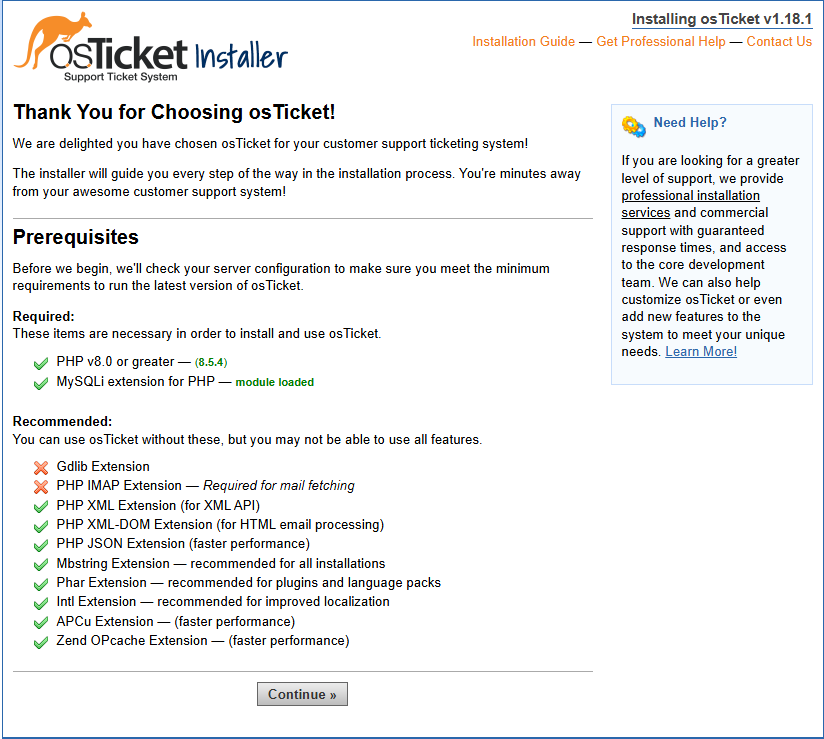
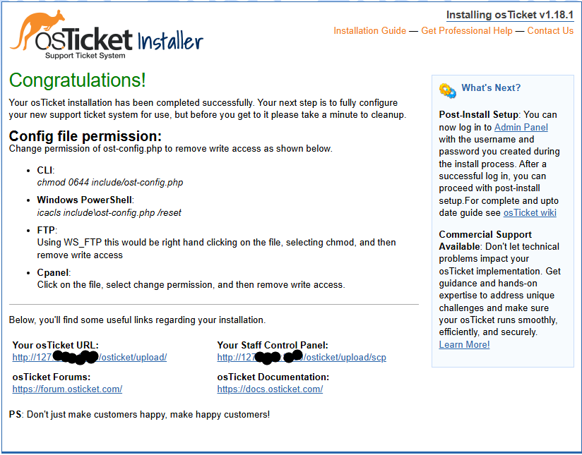
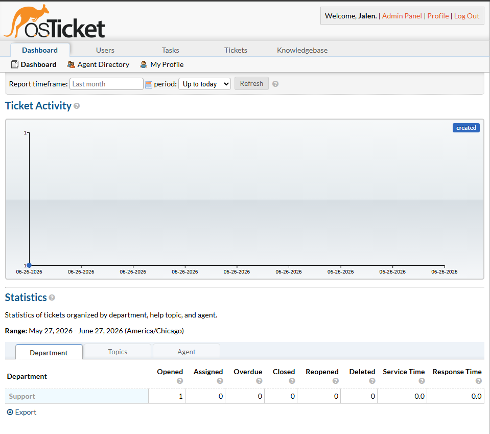
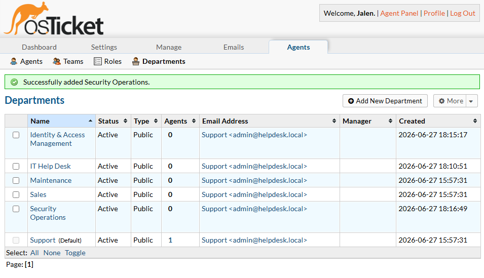
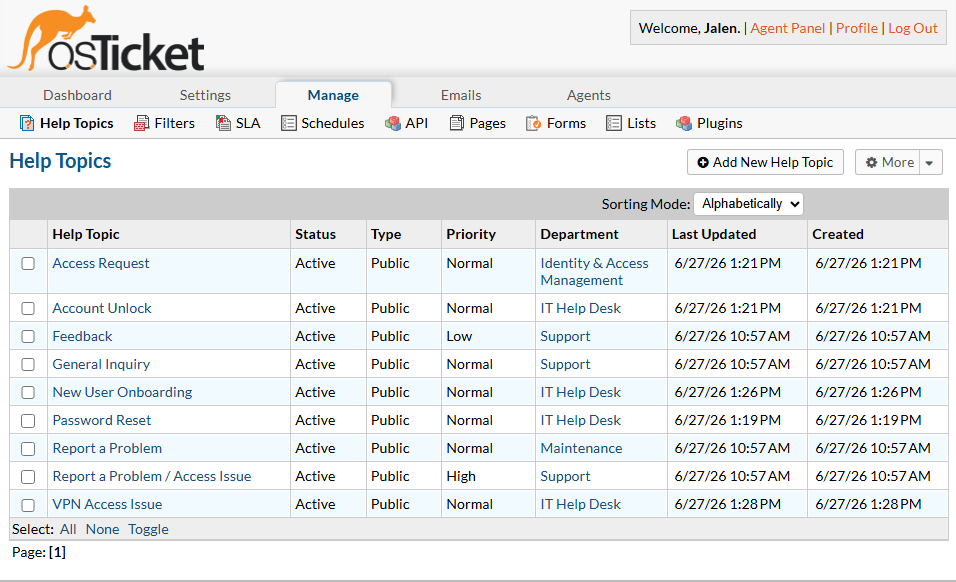
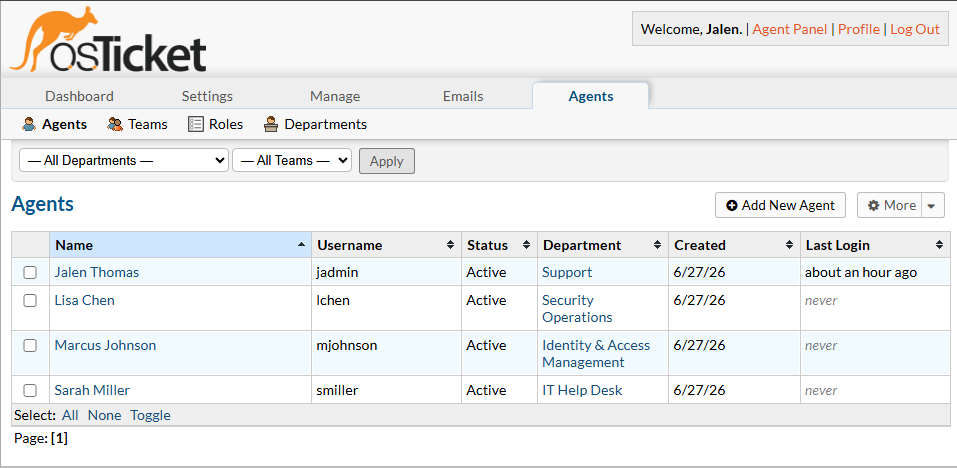
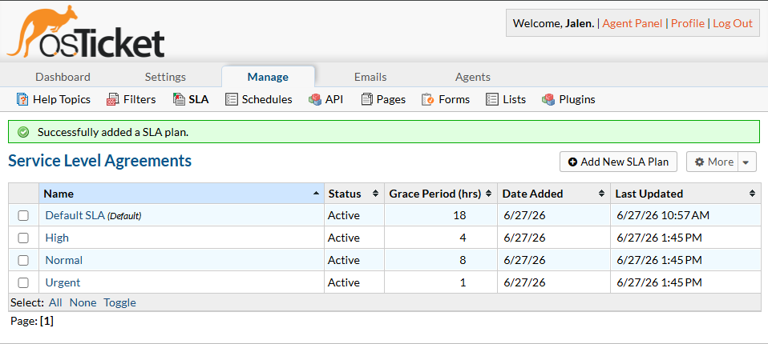
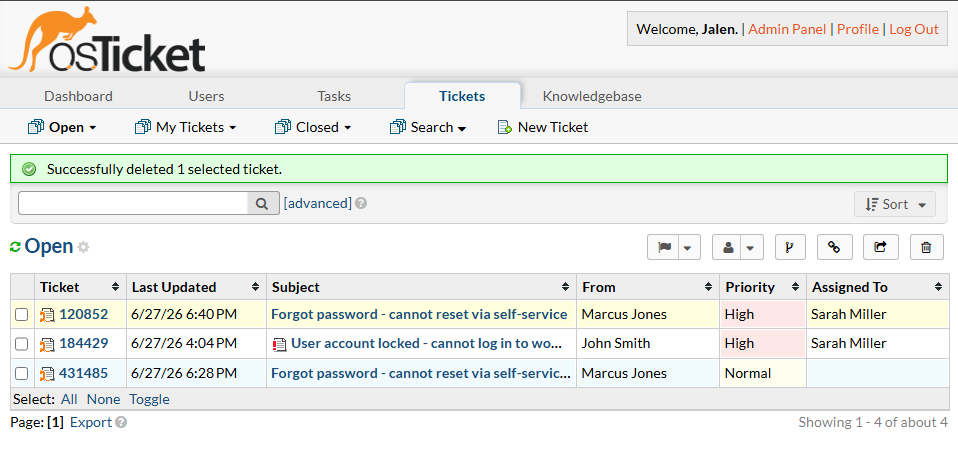
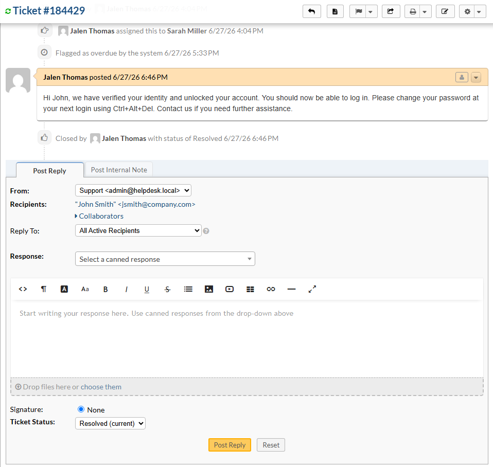
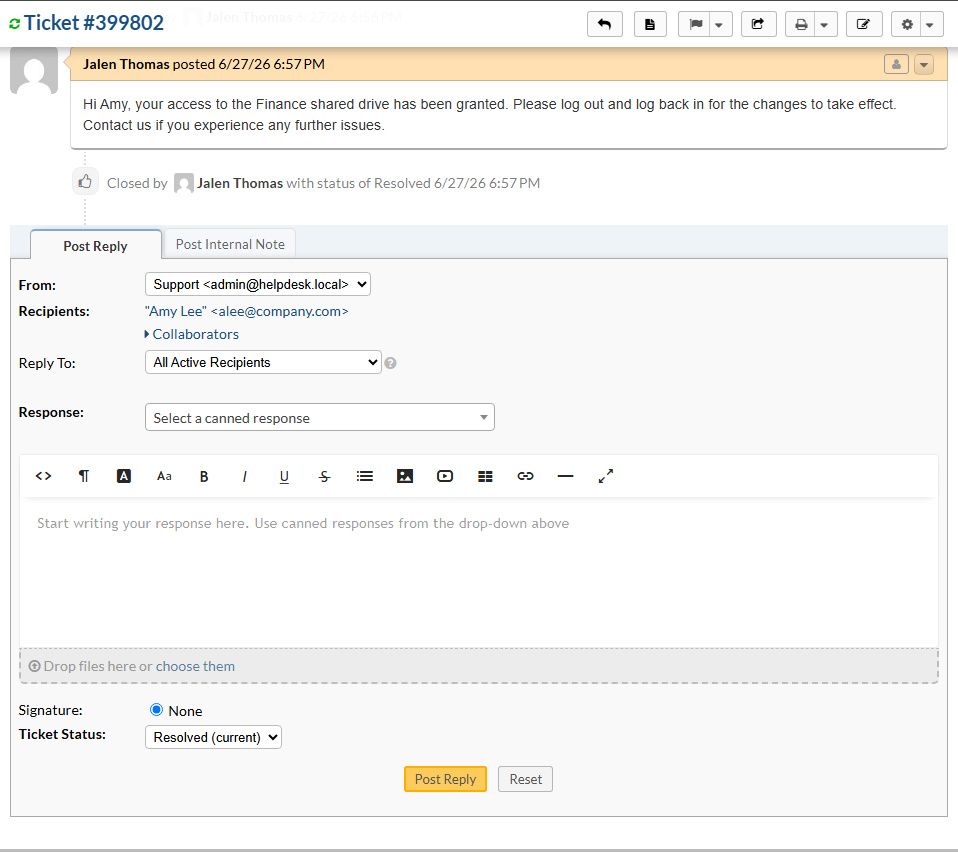

# Lab 12 — osTicket Self-Hosted Help Desk

## Objective
Deploy and configure a self-hosted IT help desk system using osTicket on 
Ubuntu Server running in VirtualBox. Build departments, help topics, agents, 
SLA plans, and simulate real help desk ticket workflows.

## Platform
- VirtualBox (existing lab environment)
- Ubuntu Server 22.04 LTS (free)
- osTicket v1.18.1 (free, open source)
- LAMP Stack (Apache, MySQL, PHP)

## Skills Demonstrated
- Linux server deployment and administration
- LAMP stack installation and configuration
- osTicket installation and post-install configuration
- Help desk department and role structure design
- SLA plan creation and assignment
- Ticket lifecycle management (create, assign, respond, resolve)
- Internal notes vs customer-visible replies
- Access control and agent permissions

## Tools Used
- VirtualBox
- Ubuntu Server 22.04 LTS
- Apache 2.4
- MySQL 8.4
- PHP 8.5
- osTicket v1.18.1

---

## Part A — Infrastructure Setup

### What I Built
A Ubuntu Server VM in VirtualBox with a full LAMP stack serving osTicket 
over port forwarding (host port 8080 → guest port 80).

### VM Specs
| Field | Value |
|-------|-------|
| VM Name | Ubuntu-HelpDesk |
| OS | Ubuntu Server 22.04 LTS |
| RAM | 2048 MB |
| Disk | 20 GB |
| Network Adapter 1 | NAT (port forwarding 8080 → 80) |
| Network Adapter 2 | Host-Only (192.168.56.101) |
| Hostname | helpdesk-server |

### LAMP Installation Commands
```bash
sudo apt update && sudo apt upgrade -y
sudo apt install apache2 mysql-server php php-mysql php-intl php-apcu php-xml php-mbstring libapache2-mod-php -y
sudo mysql_secure_installation
```

### Database Setup
```sql
CREATE DATABASE osticket;
CREATE USER 'osticket'@'localhost' IDENTIFIED BY 'Admin1234!';
GRANT ALL PRIVILEGES ON osticket.* TO 'osticket'@'localhost';
FLUSH PRIVILEGES;
```

### Key Learning
Port forwarding through VirtualBox NAT allows browser access to a VM-hosted 
web application without requiring a routable IP between the host and guest. 
This is a common pattern for lab environments and lightweight dev setups.

### Screenshots



---

## Part B — osTicket Configuration

### Departments Created
| Department | Purpose |
|------------|---------|
| IT Help Desk | Primary help desk for end user issues |
| Identity & Access Management | Access requests and provisioning |
| Security Operations | Security incidents and alerts |

### Help Topics Created
| Help Topic | Department |
|------------|------------|
| Password Reset | IT Help Desk |
| Account Unlock | IT Help Desk |
| Access Request | Identity & Access Management |
| New User Onboarding | IT Help Desk |
| VPN Access Issue | IT Help Desk |

### Agents Created
| Agent | Department | Role |
|-------|------------|------|
| Sarah Miller | IT Help Desk | All Access |
| Marcus Johnson | Identity & Access Management | All Access |
| Lisa Chen | Security Operations | All Access |

### SLA Plans Created
| Plan | Grace Period | Schedule |
|------|-------------|----------|
| Urgent | 1 hour | 24/7 |
| High | 4 hours | 24/7 |
| Normal | 8 hours | Monday-Friday 8am-5pm |

### Key Learning
Department structure in osTicket mirrors how real IT organizations separate 
responsibilities. Help topics route tickets to the right department 
automatically. SLA plans enforce response time accountability — the Urgent 
plan (1 hour, 24/7) reflects the real-world expectation for critical 
outages affecting business operations.

### Screenshots






---

## Part C — Ticket Scenarios

### Ticket 1 — Account Unlock

| Field | Value |
|-------|-------|
| User | John Smith (jsmith@company.com) |
| Help Topic | Account Unlock |
| Department | IT Help Desk |
| Priority | High |
| SLA | Urgent |
| Assigned To | Sarah Miller |
| Status | Resolved |

**Internal Note:**
Verified user identity via employee ID. Account locked due to multiple 
failed login attempts. Unlocking account in Active Directory using 
Unlock-ADAccount -Identity jsmith. Advising user on password policy.

**Customer Reply:**
Hi John, we have verified your identity and unlocked your account. 
You should now be able to log in. Please change your password at next 
login using Ctrl+Alt+Del. Contact us if you need further assistance.

### Ticket 2 — Password Reset

| Field | Value |
|-------|-------|
| User | Marcus Jones (mjones@company.com) |
| Help Topic | Password Reset |
| Department | IT Help Desk |
| Priority | High |
| SLA | High |
| Status | Resolved |

### Ticket 3 — Access Request

| Field | Value |
|-------|-------|
| User | Amy Lee (alee@company.com) |
| Help Topic | Access Request |
| Department | Identity & Access Management |
| Priority | Normal |
| SLA | Normal |
| Assigned To | Marcus Johnson |
| Status | Resolved |

**Internal Note:**
Manager Jane Doe confirmed access approval via email. Adding user alee 
to SG-Finance-ReadOnly security group in Active Directory using 
Add-ADGroupMember -Identity SG-Finance-ReadOnly -Members alee.

**Customer Reply:**
Hi Amy, your access to the Finance shared drive has been granted. 
Please log out and log back in for the changes to take effect. 
Contact us if you experience any further issues.

### Key Learning
Internal notes and customer replies serve different audiences. Internal 
notes document the analyst's investigation steps and technical actions 
taken — these are not visible to the end user. Customer replies are 
professional, non-technical updates that tell the user what happened 
and what to do next. Keeping these separate is standard help desk 
practice across all ITSM platforms including ServiceNow and Jira.

### Screenshots


bhjb

---

## Troubleshooting Notes

| Issue | Root Cause | Fix |
|-------|------------|-----|
| Host browser couldn't reach VM | Host-only adapter not routing | Used NAT port forwarding (8080 → 80) instead |
| MySQL access denied during install | MySQL 8.4 auth plugin incompatibility | Recreated user with DROP USER IF EXISTS then CREATE USER |
| Tickets not showing in agent panel | Admin account primary department mismatch | Changed jadmin primary department to IT Help Desk |
| Access denied when creating tickets | Agent missing extended department access | Added all departments to jadmin extended access |

### Key Learning
Documenting troubleshooting steps is just as valuable as documenting 
successful configurations. Every issue above reflects a real-world 
scenario — MySQL auth plugin changes between versions, RBAC misconfiguration 
causing access denied errors, and network routing issues are all common 
problems IT professionals encounter on the job.

---

## References
- [osTicket Documentation](https://docs.osticket.com)
- [Ubuntu Server Guide](https://ubuntu.com/server/docs)
- [Apache HTTP Server Docs](https://httpd.apache.org/docs)
