# Lab 13 — Active Directory Help Desk Scenarios

## Objective
Simulate 10 real-world IT help desk tickets using an on-premises Active 
Directory environment. Each scenario documents the problem, investigation 
steps, PowerShell commands used, and resolution — mirroring how a Tier 1 
or Tier 2 help desk analyst would handle these requests.

## Platform
- Windows Server 2022 (Domain Controller)
- Active Directory Domain Services (lab.local)
- PowerShell 5.1

## Skills Demonstrated
- Account unlock and lockout investigation
- Password reset with forced change at next logon
- Security group membership management (add/remove)
- User account creation and onboarding
- Account disable and offboarding
- OU management and user transfers
- Group membership auditing
- CSV reporting for manager and security team requests
- Inactive account identification

## Tools Used
- Active Directory Users and Computers (ADUC)
- Active Directory PowerShell Module
- Windows Server 2022

## Lab Environment
- Domain: lab.local
- Domain Controller: Windows Server 2022
- OUs: IT, HR, Finance, Sales
- Security Groups: SG-Finance-ReadOnly, SG-VPN-Users, SG-SharePoint-Users

---

## Ticket 01 — Account Unlock

**Scenario:** Alex Turner is locked out after multiple failed login 
attempts and cannot access her workstation or any company systems.

**Investigation:**
```powershell
Get-ADUser -Identity alex.turner -Properties LockedOut, BadLogonCount | Select Name, LockedOut, BadLogonCount
```

**Resolution:**
```powershell
Unlock-ADAccount -Identity alex.turner
Get-ADUser -Identity alex.turner -Properties LockedOut | Select Name, LockedOut
```

**Key Learning:** Always verify the user's identity before unlocking an 
account. Check BadLogonCount and BadPasswordTime to determine if this 
is a forgotten password situation or a potential brute force attempt.

**Screenshots**
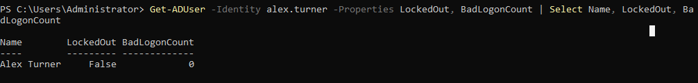
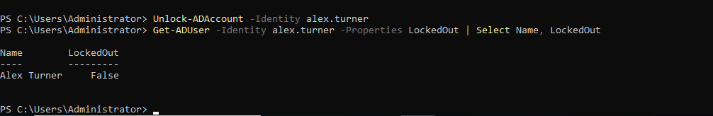

---

## Ticket 02 — Password Reset

**Scenario:** Sara Nolan forgot her password and cannot use the 
self-service reset portal. She needs an immediate reset.

**Investigation:**
```powershell
Get-ADUser -Identity sara.nolan -Properties PasswordLastSet, PasswordExpired | Select Name, PasswordLastSet, PasswordExpired
```

**Resolution:**
```powershell
Set-ADAccountPassword -Identity sara.nolan -Reset -NewPassword (ConvertTo-SecureString 'TempPass2024!' -AsPlainText -Force)
Set-ADUser -Identity sara.nolan -ChangePasswordAtLogon $true
```

**Key Learning:** Always force a password change at next logon after 
an admin reset. This ensures the temporary password is not kept and 
that only the user knows their final password — a basic security 
hygiene requirement.

**Screenshots**
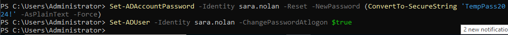
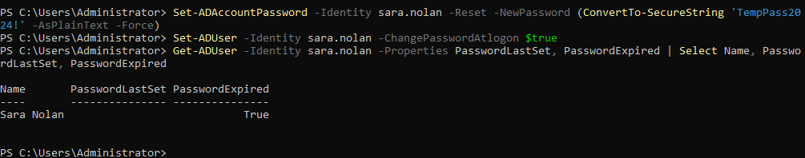

---

## Ticket 03 — Add User to Security Group (Access Request)

**Scenario:** Dan Reyes' manager has approved his access to the Finance 
shared drive. Add him to the SG-Finance-ReadOnly security group.

**Investigation:**
```powershell
Get-ADPrincipalGroupMembership -Identity dan.reyes | Select Name
```

**Resolution:**
```powershell
Add-ADGroupMember -Identity SG-Finance-ReadOnly -Members dan.reyes
Get-ADGroupMember -Identity SG-Finance-ReadOnly | Select Name
```

**Key Learning:** Access should only be granted after documented manager 
approval. Group-based access control is the correct approach — never 
grant direct permissions to individual users on shared resources.

**Screenshots**

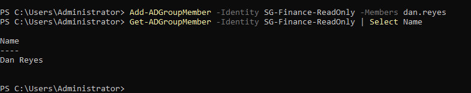

---

## Ticket 04 — Remove User from Group (Access Revocation)

**Scenario:** Dan Reyes has transferred from Finance to Sales. Remove 
Finance access immediately and add to the SharePoint users group.

**Resolution:**
```powershell
Remove-ADGroupMember -Identity SG-Finance-ReadOnly -Members dan.reyes -Confirm:$false
Add-ADGroupMember -Identity SG-SharePoint-Users -Members dan.reyes
Get-ADPrincipalGroupMembership -Identity dan.reyes | Select Name
```

**Key Learning:** Access revocation on job transfer is just as important 
as access provisioning. Leaving Finance access on a user who moved to 
Sales violates least privilege and is a common audit finding.

**Screenshots**
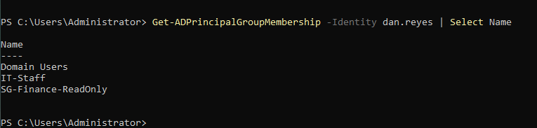
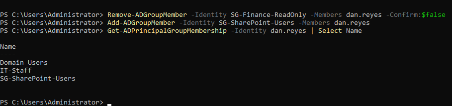

---

## Ticket 05 — Move User to New OU (Job Transfer)

**Scenario:** Dan Reyes' transfer to Sales needs to be reflected in AD 
so the correct Group Policy Objects apply to his account.

**Investigation:**
```powershell
Get-ADUser -Identity dan.reyes | Select DistinguishedName
```

**Resolution:**
```powershell
Get-ADUser -Identity dan.reyes | Move-ADObject -TargetPath "OU=Sales,DC=lab,DC=local"
Get-ADUser -Identity dan.reyes | Select DistinguishedName
```

**Key Learning:** OU placement determines which GPOs apply to a user. 
Moving a user to the correct OU ensures they get the right security 
settings, drive mappings, and software deployments for their new role.

**Screenshots**
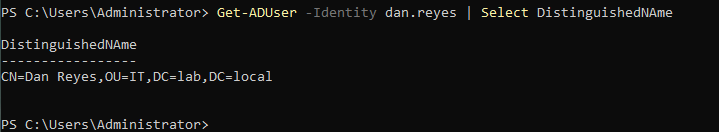
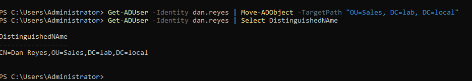

---

## Ticket 06 — Disable Account (Employee Termination)

**Scenario:** Maria Gomez has been terminated. Disable the account 
immediately per security policy and document the action.

**Investigation:**
```powershell
Get-ADUser -Identity maria.gomez -Properties Enabled | Select Name, Enabled
```

**Resolution:**
```powershell
Disable-ADAccount -Identity maria.gomez
Set-ADUser -Identity maria.gomez -Description "Terminated $(Get-Date -Format yyyy-MM-dd) - Ticket #06"
Get-ADUser -Identity maria.gomez -Properties Enabled, Description | Select Name, Enabled, Description
```

**Key Learning:** Accounts should be disabled rather than deleted on 
termination — deletion is irreversible and may affect audit trails or 
file ownership records. The description field creates a permanent record 
of when and why the account was disabled.

**Screenshots**
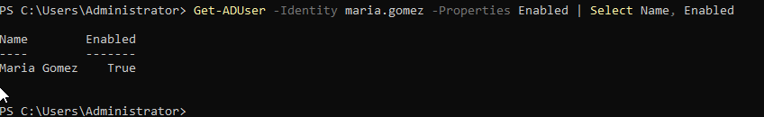
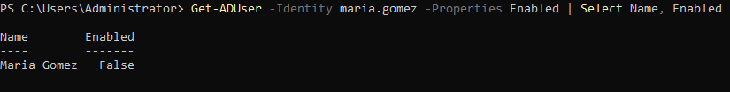

---

## Ticket 07 — Create New User Account (Onboarding)

**Scenario:** New hire Dana Torres is starting Monday in the IT 
department. Create her AD account and provision access.

**Resolution:**
```powershell
New-ADUser -Name "Dana Torres" -GivenName "Dana" -Surname "Torres" -SamAccountName "dtorres" -UserPrincipalName "dtorres@lab.local" -Path "CN=Users,DC=lab,DC=local"
Set-ADAccountPassword -Identity dtorres -Reset -NewPassword (ConvertTo-SecureString 'Welcome@2024!IT' -AsPlainText -Force)
Set-ADUser -Identity dtorres -ChangePasswordAtLogon $true -Enabled $true
Enable-ADAccount -Identity dtorres
Get-ADUser -Identity dtorres | Move-ADObject -TargetPath "OU=IT,DC=lab,DC=local"
Get-ADUser -Identity dtorres -Properties Enabled | Select Name, SamAccountName, Enabled, DistinguishedName
```

**Troubleshooting Note:** Initial attempts to create the user directly 
in the IT OU failed with "server is unwilling to process the request". 
Resolved by creating in the default Users container first, then moving 
to the correct OU after account creation.

**Key Learning:** New accounts should always require a password change 
at first logon. The user's UPN (dtorres@lab.local) must match the domain 
suffix. OU placement should reflect the user's department for correct 
GPO application.

**Screenshots**
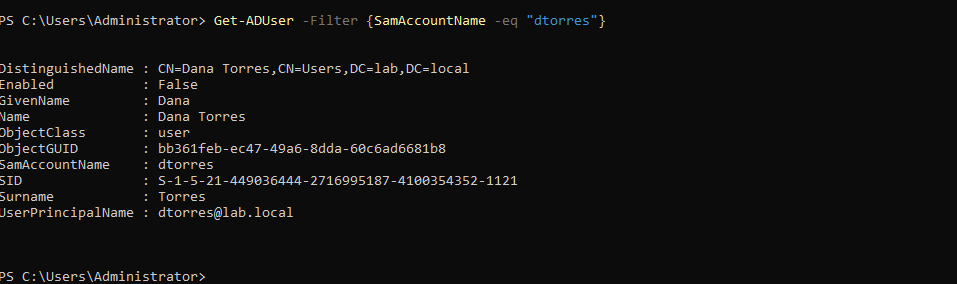
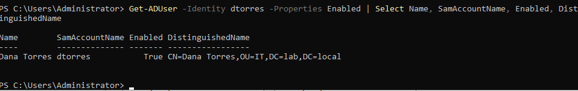

---

## Ticket 08 — Check User Group Memberships (Troubleshooting)

**Scenario:** James Park reports he cannot access a shared resource. 
Audit all group memberships to identify missing access.

**Resolution:**
```powershell
Get-ADPrincipalGroupMembership -Identity james.park | Select Name | Sort Name
```

**Key Learning:** Group membership auditing is the first step in any 
access troubleshooting ticket. This command shows all groups the user 
belongs to, making it easy to identify missing group memberships that 
would explain access denied errors.

**Screenshot**
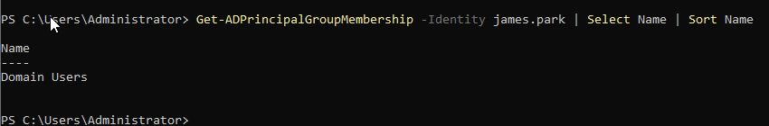

---

## Ticket 09 — Export OU Users (Manager Report)

**Scenario:** Finance department manager requests a list of all active 
users in the Finance OU for a quarterly access review.

**Resolution:**
```powershell
Get-ADUser -Filter * -SearchBase "OU=Finance,DC=lab,DC=local" -Properties Department, Title, Enabled | Select Name, SamAccountName, Title, Enabled | Export-Csv -Path C:\finance-users.csv -NoTypeInformation
Get-Content C:\finance-users.csv
```

**Key Learning:** Exporting user lists to CSV is a common help desk 
and IAM task used for access reviews, compliance reporting, and 
manager approvals. The -NoTypeInformation flag keeps the CSV clean 
without PowerShell type headers.

**Screenshot**
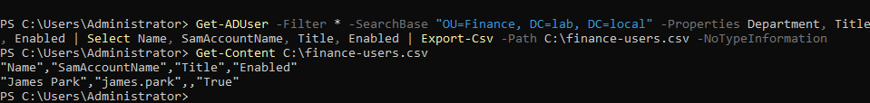

---

## Ticket 10 — Find Inactive Accounts (Security Audit)

**Scenario:** Security team requests a report of all enabled accounts 
and their last logon dates to identify potentially stale accounts.

**Resolution:**
```powershell
Get-ADUser -Filter {Enabled -eq $true} -Properties LastLogonDate | Select Name, SamAccountName, LastLogonDate | Sort LastLogonDate | Export-Csv -Path C:\inactive-accounts.csv -NoTypeInformation
Get-Content C:\inactive-accounts.csv
```

**Key Learning:** In production environments, accounts with no logon 
in 90+ days are candidates for disablement. Null LastLogonDate values 
indicate accounts that have never been used — these should be reviewed 
and either provisioned properly or disabled. Regular inactive account 
audits are a core IAM governance control.

**Screenshot**
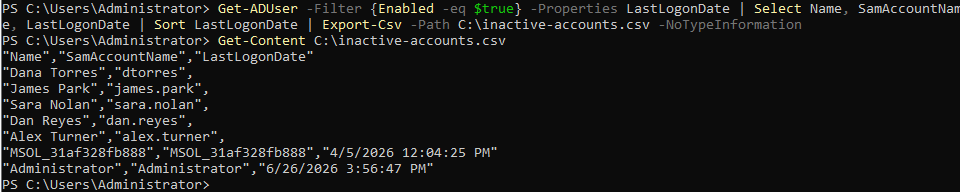

---

## PowerShell Command Reference

| Task | Command |
|------|---------|
| Check lock status | `Get-ADUser -Identity user -Properties LockedOut` |
| Unlock account | `Unlock-ADAccount -Identity user` |
| Reset password | `Set-ADAccountPassword -Identity user -Reset -NewPassword (...)` |
| Force password change | `Set-ADUser -Identity user -ChangePasswordAtLogon $true` |
| Add to group | `Add-ADGroupMember -Identity group -Members user` |
| Remove from group | `Remove-ADGroupMember -Identity group -Members user -Confirm:$false` |
| Check group memberships | `Get-ADPrincipalGroupMembership -Identity user` |
| Move to OU | `Get-ADUser -Identity user \| Move-ADObject -TargetPath "OU=..."` |
| Disable account | `Disable-ADAccount -Identity user` |
| Create new user | `New-ADUser -Name "..." -SamAccountName "..." -Path "..."` |
| Export to CSV | `Get-ADUser -Filter * \| Select ... \| Export-Csv -Path C:\file.csv` |

---

## References
- [Microsoft Docs — Active Directory PowerShell](https://docs.microsoft.com/en-us/powershell/module/activedirectory)
- [CompTIA A+ Help Desk Objectives](https://www.comptia.org/certifications/a)
