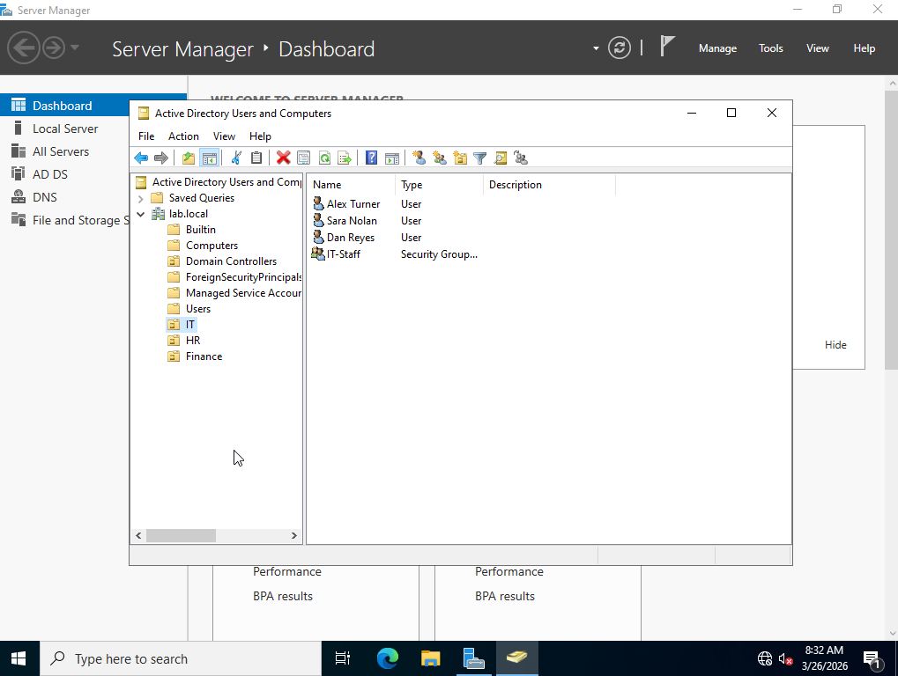
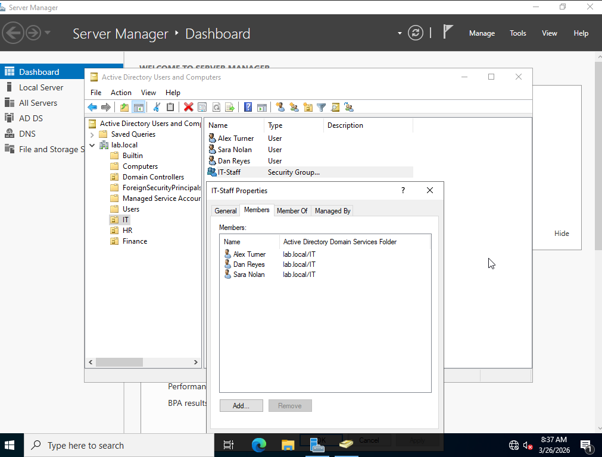
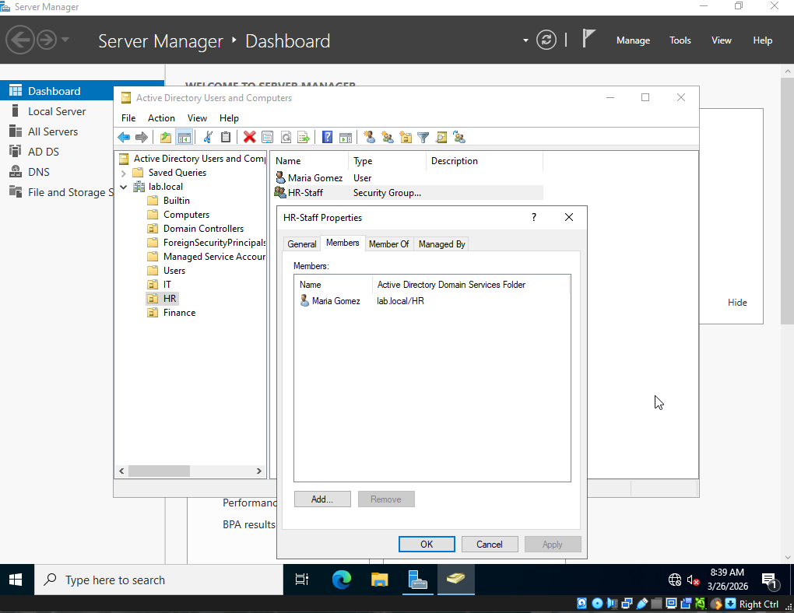

# Lab 6 — Organizational Units & Users in Active Directory

## Objective
Create a structured Active Directory environment with 
Organizational Units, users, and security groups simulating 
a real enterprise AD deployment.

## Environment
- Windows Server 2022 Standard Evaluation (Desktop Experience)
- Active Directory Domain Services
- Domain: lab.local
- VirtualBox VM (8GB RAM, 4 CPUs, 60GB disk)

## What I did

### Organizational Units created
- OU=IT,DC=lab,DC=local
- OU=HR,DC=lab,DC=local
- OU=Finance,DC=lab,DC=local

### Users created
| Name | Username | OU |
|------|----------|----|
| Alex Turner | alex.turner | IT |
| Sara Nolan | sara.nolan | IT |
| Dan Reyes | dan.reyes | IT |
| Maria Gomez | maria.gomez | HR |
| James Park | james.park | Finance |

### Security groups created
- IT-Staff (Global Security) — members: Alex Turner, Sara Nolan, Dan Reyes
- HR-Staff (Global Security) — members: Maria Gomez

## What I observed
- OUs act as containers for organizing users by department
- Security groups control access to resources
- Users must be in the correct OU before being added to groups
- Global security groups can be used across the domain

## Skills demonstrated
- Organizational Unit design and creation
- User account provisioning in Active Directory
- Security group creation and membership management
- Active Directory Users and Computers (ADUC) navigation

## Tools used
- Active Directory Users and Computers (ADUC)
- Windows Server 2022
- VirtualBox

## Screenshots

